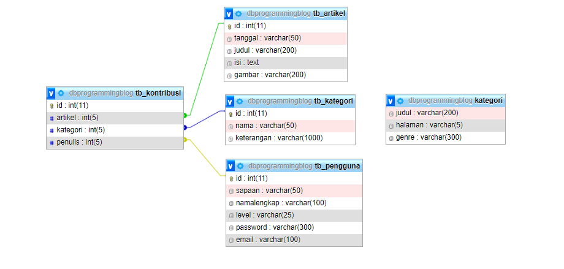
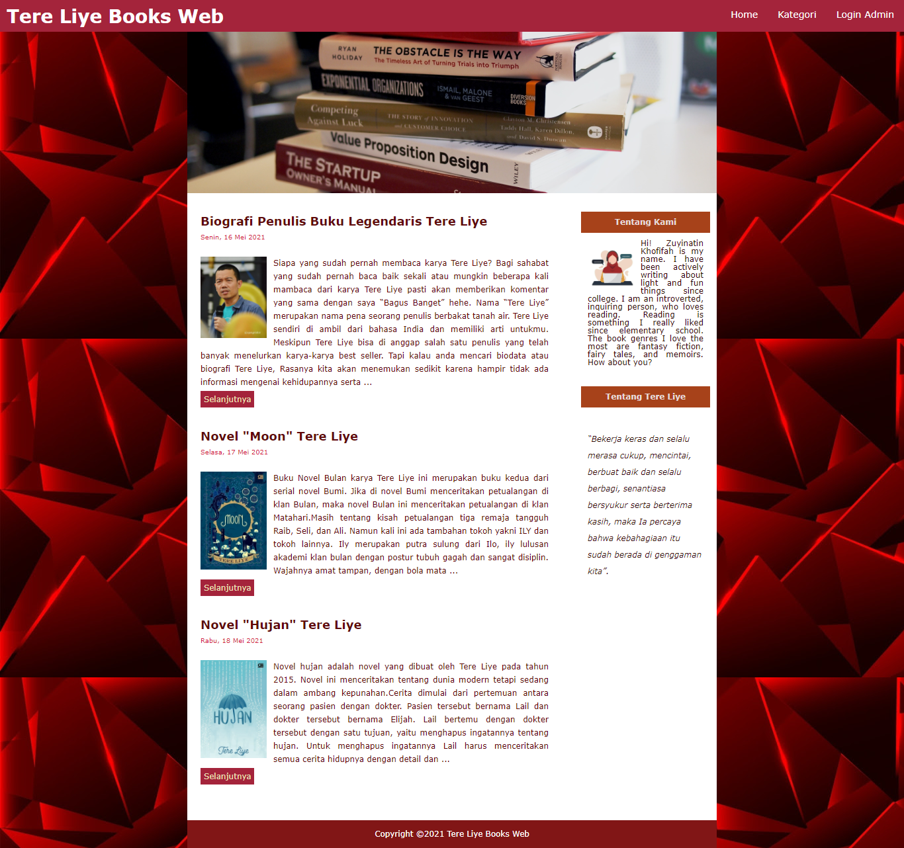
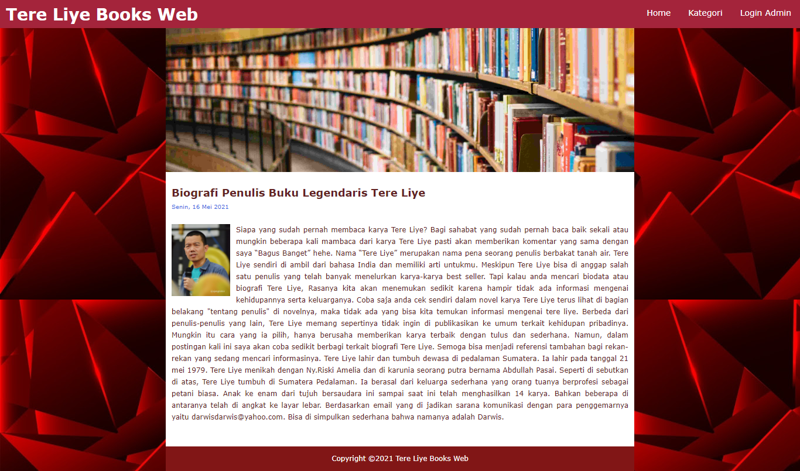
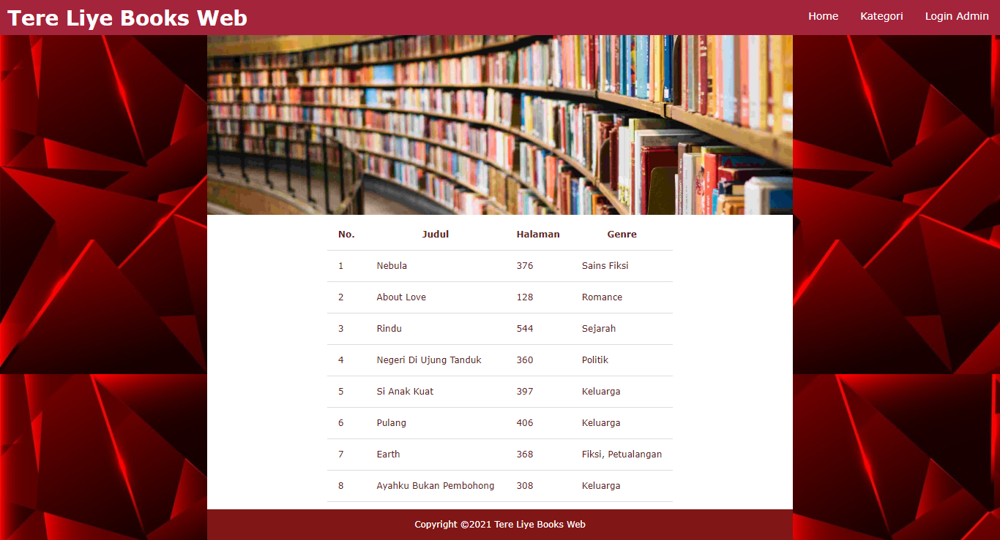
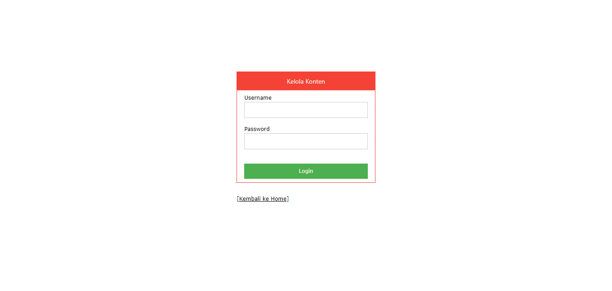
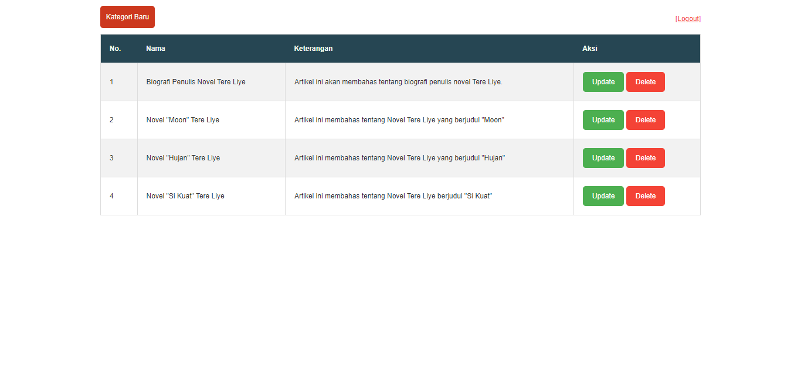

<h1 align="center">Tere Liye Books Web</h1>


**Tere Liye Books Web 📚** adalah sebuah aplikasi web yang menampilkan koleksi buku dari penulis Tere Liye. Aplikasi ini dibangun secara native menggunakan PHP, JavaScript, HTML, CSS, dan MySQL sebagai basis datanya. Web ini memungkinkan pengunjung untuk melihat daftar buku, membaca artikel blog, serta memiliki panel admin untuk mengelola kategori buku.

## Daftar Isi
1. [Fitur Utama](#fitur-utama)
2. [Teknologi yang Digunakan](#teknologi-yang-digunakan)
3. [Struktur Direktori](#struktur-direktori)
4. [Cara Instalasi](#cara-instalasi)
5. [Entity Relationship Diagram (ERD)](#entity-relationship-diagram-erd)
6. [Preview Tampilan Website](#preview-tampilan-website)
7. [Kesimpulan](#kesimpulan)
8. [Kontributor](#kontributor)

## Fitur Utama
1. **Halaman Home**: 
   - Terdiri dari dua layout.
     - **Layout 1**: Menampilkan daftar postingan blog yang berisikan judul, tanggal, cuplikan artikel, dan tautan "Selanjutnya" untuk mengakses artikel penuh.
     - **Layout 2**: Berisi tentang pengembang web dan informasi singkat mengenai Tere Liye.
  
2. **Halaman Detail Blog**: 
   - Menampilkan konten penuh dari sebuah artikel setelah pengguna memilihnya dari daftar postingan di halaman home.
  
3. **Halaman Kategori Buku**: 
   - Katalog buku Tere Liye disusun dalam tabel yang menampilkan informasi seperti:
     - Nomor urut
     - Judul buku
     - Jumlah halaman
     - Genre buku
  
4. **Halaman Login Admin**: 
   - Admin dapat masuk ke panel administrasi dengan memasukkan username dan password.
  
5. **Halaman Kelola Kategori Buku**: 
   - Panel admin dengan fitur CRUD untuk mengelola kategori buku:
     - **Create**: Tambah kategori baru.
     - **Read**: Lihat daftar kategori yang ada.
     - **Update**: Ubah informasi kategori yang ada.
     - **Delete**: Hapus kategori yang sudah tidak diperlukan.

## Teknologi yang Digunakan
- **Frontend**: HTML, CSS, JavaScript
- **Backend**: PHP
- **Database**: MySQL

## Struktur Direktori
```
tereliye-books-web-native/
│
├── css/
│   ├── rensponsive.css
│   └── weblayout.css
│
├── database/
│   └── dbprogrammingblog.sql
│
├── images/
│
├── kelola/
│   ├── css/
│   │   ├── stylelogin.css
│   │   └── styletabel.css
│   │
│   ├── fungsi.php
│   ├── kategorihapus.php
│   ├── kategoriinset.php
│   ├── kategorikelola.php
│   ├── kategoriprosesupdate.php
│   ├── koneksi.php
│   ├── loginaksi.php
│   └── logoutaksi.php
│
├── Markdown/
│
├── fungsi.php
├── koneksi.php
├── weblayout.php
├── weblayout2.php
└── README.md
```

## Cara Instalasi

Untuk menginstal dan menjalankan aplikasi **Tere Liye Books Web**, ikuti langkah-langkah berikut:

### Prerequisites
1. **Web Server**: Pastikan Anda telah menginstal server lokal seperti XAMPP, WAMP, atau MAMP. Ini akan menyediakan PHP dan MySQL.
2. **Browser**: Anda membutuhkan browser modern seperti Google Chrome, Mozilla Firefox, atau Safari untuk mengakses aplikasi.

### Langkah-langkah Instalasi
1. **Clone atau Download Repository**
   - Anda dapat meng-clone repository ini menggunakan perintah git berikut:
     ```bash
     git clone https://github.com/ZuyinatinK/tereliye-books-web-native.git
     ```
   - Atau, Anda dapat mengunduhnya sebagai ZIP dari halaman GitHub dan mengekstraknya.

2. **Import Database**
   - Buka aplikasi phpMyAdmin yang disediakan oleh XAMPP/WAMP.
   - Buat database baru, misalnya dengan nama `tereliye_books`.
   - Pilih database yang baru dibuat, lalu klik pada tab "Import".
   - Pilih file `dbprogrammingblog.sql` yang ada di direktori `database` dalam proyek Anda.
   - Klik "Go" untuk mengimpor database.

3. **Konfigurasi Koneksi Database**
   - Buka file `koneksi.php` yang terletak di direktori utama proyek.
   - Sesuaikan detail koneksi database sesuai dengan pengaturan server lokal Anda. Contohnya:
     ```php
     <?php
     $host = "localhost";
     $user = "root"; // biasanya "root" untuk XAMPP
     $pass = ""; // jika tidak ada password, biarkan kosong
     $dbname = "tereliye_books"; // nama database yang telah Anda buat
     
     $conn = mysqli_connect($host, $user, $pass, $dbname);
     if (!$conn) {
         die("Connection failed: " . mysqli_connect_error());
     }
     ?>
     ```

4. **Menjalankan Aplikasi**
   - Pindahkan folder proyek yang telah Anda download/clone ke dalam direktori `htdocs` (untuk XAMPP) atau `www` (untuk WAMP).
   - Buka browser Anda dan masukkan URL berikut:
     ```
     http://localhost/tereliye-books-web-native/
     ```
   - Anda akan melihat halaman home dari aplikasi **Tere Liye Books Web**.

5. **Login sebagai Admin**
   - Untuk mengakses panel admin, navigasikan ke halaman login dengan URL:
     ```
     http://localhost/tereliye-books-web-native/kelola/login.php
     ```
   - Masukkan username dan password admin yang telah Anda set sebelumnya (atau sesuaikan dengan pengaturan di database).

### Troubleshooting
- **Jika terjadi kesalahan koneksi database**: Periksa kembali pengaturan di `koneksi.php` untuk memastikan host, username, password, dan nama database sudah benar.
- **Jika halaman tidak dapat dimuat**: Pastikan server lokal Anda berjalan (XAMPP/WAMP) dan Anda telah memindahkan folder proyek ke direktori yang tepat.

Dengan mengikuti langkah-langkah di atas, Anda seharusnya dapat menginstal dan menjalankan aplikasi **Tere Liye Books Web** tanpa masalah. Jika ada pertanyaan lebih lanjut, jangan ragu untuk menghubungi kontributor.

## Entity Relationship Diagram (ERD)
ERD untuk proyek ini memvisualisasikan struktur basis data yang digunakan. Diagram ini berisi entitas yang merepresentasikan tabel database, seperti tabel kontribusi, artikel, kategori, dan pengguna. Hubungan antar entitas ini menunjukkan bagaimana data berinteraksi satu sama lain dalam sistem.




## Preview Tampilan Website 🚀
Berikut adalah beberapa tampilan dari website **Tere Liye Books Web**:

### Halaman Home




### Halaman Detail Blog




### Halaman Kategori Buku




### Halaman Login Admin




### Halaman Kelola Kategori Buku




## Kesimpulan
Aplikasi **Tere Liye Books Web** berhasil dikembangkan sebagai project akhir UAS Mata Kuliah Pemrograman Web. Dengan menggunakan teknologi PHP dan MySQL, aplikasi ini mampu menyajikan informasi buku dengan cara yang interaktif dan mudah diakses. Fitur-fitur yang disediakan, baik untuk pengunjung maupun admin, menjadikan aplikasi ini bermanfaat untuk mengelola koleksi buku dan artikel terkait penulis Tere Liye. Pengalaman ini memperkaya pemahaman dalam pengembangan aplikasi web dinamis dan manajemen database.

## Kontributor
Proyek ini dikembangkan sebagai tugas akhir UAS mata kuliah Pemrograman Web pada tahun 2021 oleh Zuyinatin Khofifah. Proyek ini dibuat dengan tujuan memberikan pengalaman praktis dalam membangun aplikasi web dinamis dengan menggunakan teknologi PHP dan MySQL.
